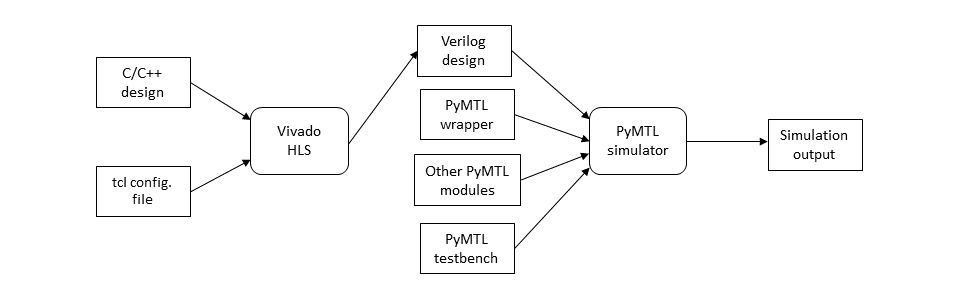

PyMTL/HLS Framework
==========================================================================

This repository was originally focused on our PolyHS project, but more
generally it illustrates our current PyMTL/HLS framework. The following
tutorial explains how to use the framework to experiment with a GCD
accelerator which does not interact with memory and a sorting accelerator
which does interact with memory. Both accelerators will use the standard
xcelreq/xcelresp interfaces for managing the accelerator. This tutorial
assumes you have already completed the "basic" ECE 5745 tutorials on
Linux, Git, PyMTL, and Verilog, as well as the new ECE 5745 ASIC tutorial
and the ECE 5745 PARCv2 accelerator tutorial.

The first step is to clone this repository from GitHub, define an
environment variable to keep track of the top directory for the project,
source a special setup script which will setup the Xilinx HLS tools, and
create a build directory.a

```
 % source setup-hls.sh
 % mkdir -p ${HOME}/vc/git-hub/cornell-brg
 % cd ${HOME}/vc/git-hub/cornell-brg
 % git clone git@github.com:cornell-brg/pymtl-polyhs.git
 % cd pymtl-polyhs
 % TOPDIR=$PWD
 % mkdir -p $TOPDIR/build
```

Introduction
--------------------------------------------------------------------------
In this tutorial, we will walk through the essential steps for synthesizing 
a C/C++ design into RTL with Vivado HLS, integrating the synthesized RTL 
design with other functional or RTL models using PyMTL, and leveraging the 
PyMTL framework to perform functional and cycle-level verification. 
We will first describe the basic steps for implementing the entire synthesis 
and testing flow, and then describe advanced techniques for modeling and 
testing more complicated designs.

Vivado HLS compiles software programs into cycle-accurate RTL models in 
Verilog or VHDL. By targeting FPGA as the underlying hardware fabric, 
Vivado HLS allows engineers to write software to describe their design and 
conveniently optimize the design for hardware performance through user-
defined directives.

PyMTL is a Python-based hardware modeling framework for functional to cycle-
level modeling and verification. By default, PyMTL allows us to use Python-
like constructs to model designs at the RTL level. In addition, PyMTL allows 
wrapping Verilog RTL models within a Python-based RTL model and integrating 
with other Python-based functional or RTL models so that the entire design 
can be simulated and tested as a whole. PyMTL's source code and tutorials 
are available at https://github.com/cornell-brg/pymtl.

The Vivado HLS plus PyMTL framework allows us to synthesize a C/C++ design 
into Verilog RTL module and simulate the RTL module together with other 
modules in the overall system. The following figure shows the basic flow of 
synthesizing a C/C++ design and integrating it into PyMTL simulation 
framework.



To begin, a synthesizeble C/C++ design is passed to Vivado HLS using a tcl 
file interface. We then wrap the generate Verilog file with a PyMTL wrapper, 
which exposes the original design as a PyMTL hardware module using valid-
ready-based handshaking interface. The handshaking interface makes it easy 
to test the design with test source and test sink. Finally, PyMTL simulates 
the wrapped Verilog design using user-defined testbench file. 

Getting Started: Population Count Example
--------------------------------------------------------------------------


GCD Accelerator FL Model
--------------------------------------------------------------------------

We can start with a simple GCD unit FL model written in PyMTL. You can
run the unit tests for this model like this:

```
 % cd $TOPDIR/build
 % py.test ../ex_gcd/GcdXcelFL_test.py
 % py.test ../ex_gcd/GcdXcelFL_test.py -s -k basic0x0

     xcelreq                xcelresp
  --------------------------------------------
  3: 7c:wr:01:0000000f:000()
  4: #                    ()7c:wr:        :000
  5: 00:wr:02:00000005:000()
  6: #                    ()00:wr:        :000
  7: 18:rd:00:        :000()
  8: #                    ()18:rd:00000005:000
```

The line trace has been edited to make it more compact and includes
annotations. Unlike the GCD unit used in our PyMTL tutorial, this GCD
unit is designed to be an accelerator and thus supports the
xcelreq/xcelresp interface with the following accelerator registers:

 - xr0 : go/result
 - xr1 : operand A
 - xr2 : operand B

and the following accelerator protocol:

 1. Write the operand A by writing to xr1
 2. Write the operand B by writing to xr2
 3. Tell the accelerator to compute gcd and wait for result by reading xr0

We can see this accelerator protocol in the line trace. The test source
sends two xcelreq messages to write xr1 and xr2 before reading xr0. Since
this is an FL model, the accelerator immediately returns the
corresponding result.

GCD Accelerator HLS Model
--------------------------------------------------------------------------

Now let's explore how we can use high-level synthesis (HLS) to
automatically transform a high-level C++ specification (similar to the FL
model described above) into a register-transfer level (RTL)
implementation. Let's take a closer look at the files in the `ex_gcd`
subdirectory:

 - `GcdXcelFL.py` : PyMTL FL model
 - `GcdXcelFL_test.py` : PyMTL unit tests for FL model
 - `GcdXcelHLS.cc` : High-level C++ implementation
 - `GcdXcelHLS.h` : High-level C++ interface
 - `GcdXcelHLS.t.cc` : Pure C++ unit tests for C++ implementation
 - `GcdXcelHLS.tcl` : TCL file to drive HLS tool
 - `GcdXcelHLS.py` : Verilog wrapper for RTL synthesized from HLS
 - `GcdXcelHLS_test.py` : PyMTL unit tests for RTL synthesized  from HLS
 - `__init__.py` : Python package for using GCD accelerator in other projects
 - `ex_gcd.ac` : autoconf fragment for build system
 - `ex_gcd.mk.in` : make fragment for build system

Take a closer look at the `ex_gcd.mk.in` make fragment to see the various
make variables which need to be set to ensure the build system knows
about the C++ header files, C++ inline files, C++ implementation files,
and pure-C++ unit-test files. If you create your own subproject you will
need to set the make variables accordingly. You will also need to update
the `ex_gcd.ac` autoconf fragment. See the `mcppbs-uguide.txt` located in
this repository for more information on the basic C++ build system. The
only difference is that there is an additional `ex_gcd_hls_srcs` make
variable where you can list which top-level C++ implementation files are
meant for HLS.

So we start by writing a high-level C++ implementation. Here is what
`GcdXcelHLS.cc` looks like:

```cpp
 #include "ex_gcd/GcdXcelHLS.h"

 using namespace xcel;

 ap_uint<32> gcd( ap_uint<32> opA, ap_uint<32> opB ) {
   #pragma HLS INLINE

   while ( opA != opB ) {
     #pragma HLS PIPELINE
     if ( opA > opB )
       opA = opA - opB;
     else
       opB = opB - opA;
   }
   return opA;
 }

 void GcdXcelHLS(
   hls::stream<xcel::XcelReqMsg>&  xcelreq,
   hls::stream<xcel::XcelRespMsg>& xcelresp
 )
 {
   XcelWrapper<3> xcelWrapper( xcelreq, xcelresp );

   // configure
   xcelWrapper.configure();

   // compute
   ap_uint<32> result = gcd( xcelWrapper.get_xreg(1), xcelWrapper.get_xreg(2) );

   // signal done
   xcelWrapper.done( result );
 }
```

All of this C++ code will be pushed through the HLS tools. The top-level
GcdXcelHLS function corresponds to the top-level RTL module that will be
generated by the HLS tools. Notice how `hls::stream` objects are passed
as parameters into this function; this will result in two latency
insensitive interfaces on the top-level RTL module: one for xcelreq and
one for xcelresp. The top-level function uses a helper `XcelWrapper`
class that elegantly handles the xcelreq/xcelresp messages. The
`xcelWrapper.configure()` method will return when the `XcelWrapper`
object receives a read xcelreq messages. The top-level function then
calls the `gcd` method.

The `HLS INLINE` pragma ensures that the `gcd` method is inlined into the
top-level function and that only a single RTL module will be synthesized.
The `gcd` function is implemented as regular C++ code. The `HLS PIPELINE`
pragma is a performance hint that tells the HLS tools to pipeline the
while loop if possible. The final call to `xcelWrapper.done()` will
result in returning an xcelresp message with the result.

We should _always_ start by testing our C++ code using a pure-C++ unit
test. I the code does not work natively, then there is no chance it is
going to work after synthesis, and debugging the synthesized RTL can be
quite tedious. We use the simple `utst` unit testing framework which is
also included in this repository. Here is an example of a simple test
case:

```cpp
void run_test( const std::vector<std::pair<int,int> >& data,
               const std::vector<int>&                 ref   )
{
  // Create configuration req/resp streams

  hls::stream<XcelReqMsg>  xcelreq;
  hls::stream<XcelRespMsg> xcelresp;

  for ( unsigned i = 0; i < data.size(); ++ i )  {

    // Insert configuration requests to do compute gcd
    //                         opq type  addr data           id
    xcelreq.write( XcelReqMsg( 0,     1,   1, data[i].first,  0 ) );
    xcelreq.write( XcelReqMsg( 0,     1,   2, data[i].second, 0 ) );
    xcelreq.write( XcelReqMsg( 0,     0,   0, 0,              0 ) );

    // compute
    GcdXcelHLS( xcelreq, xcelresp );

    // Drain the response for writes
    xcelresp.read();
    xcelresp.read();

    // Verify the results
    XcelRespMsg resp = xcelresp.read();
    UTST_CHECK_EQ( resp.data(), ref[i] );
  }
}

UTST_AUTO_TEST_CASE( TestBasic )
{
  std::vector<std::pair<int,int> > data;
  std::vector<int>                 ref;

  data.push_back( std::make_pair( 15,  5 ) ); ref.push_back(  5 );
  data.push_back( std::make_pair(  9,  3 ) ); ref.push_back(  3 );
  ...

  run_test( data, ref );
}
```

The unit test creates a vector of input data and a vector of reference
outputs. The `run_test()` function explicitly create xcelreq messages
which correspond to configuring/starting the accelerator and places these
messages in the corresponding `hls::stream` object. We then simply call
the top-level function which will dequeue xcelreq messages and enqueue
xcelresp messages. Once the top-level function returns, to verify the
functionality we drain the response queue and compare the results to the
reference outputs. See the user guide in `utst/utst.txt` for more on the
C++ unit testing framework. Let's run this unit test:

```
 % cd $TOPDIR/build
 % ../configure
 % make ex_gcd/GcdXcelHLS-utst
 % ./ex_gcd/GcdXcelHLS-utst
```

All of the unit tests should pass. Now that we are sure that our pure-C++
implementation is working, we can push the C++ through the HLS flow. Note
that if you are creating a new subproject, you will need to change the
`top` variable in the equivalent of the `GcdXcelHLS.tcl` script to ensure
it points to the correct design. The build system has a special target
for pushing a specific top-level C++ implementation file through the HLS
flow:

```
 % cd $TOPDIR/build
 % make hls-ex_gcd
 % more ../ex_gcd/GcdXcelHLS.v
```

You will see the HLS tool parsing, analyzing, and optimizing the design
before eventually generating the synthesized RTL. Due to some PyMTL
issues, the synthesized Verilog is moved back into the source directory
so that it is in the same place as the PyMTL wrapper used for Verilog
import. Take a closer look at the synthesized RTL. Notice how it has the
following interface:

```
 module GcdXcelHLS (
   ap_clk,
   ap_rst,
   xcelreq_V_bits_V,
   xcelreq_V_bits_V_ap_vld,
   xcelreq_V_bits_V_ap_ack,
   xcelresp_V_bits_V,
   xcelresp_V_bits_V_ap_vld,
   xcelresp_V_bits_V_ap_ack
 );
```

We can see that the HLS tools has generated two latency insensitive
interfaces with control signals named `vld` and `ack`. These are used in
essentially the same way as our standard val/rdy microprotocol. The next
step is to test the synthesized RTL. We can use PyMTL's Verilog import
feature to bring the synthesized RTL back into the PyMTL framework, and
this enables us to reuse the same tests we developed for the FL model.
Here is how to run the FL unit tests on the synthesized RTL:

```
 % cd $TOPDIR/build
 % py.test ../ex_gcd/GcdXcelHLS_test.py
 % py.test ../ex_gcd/GcdXcelHLS_test.py -s -k basic0x0

     xcelreq                    xcelresp
  ------------------------------------------------
  2: .                     >  > .
  3: 7c:wr:01:0000000f:000 >  > 7c:wr:        :000
  4: 00:wr:02:00000005:000 >  > 00:wr:        :000
  5: 18:rd:00:        :000 >  >
  6: #                     >  >
  7: #                     >  >
  8: #                     >  >
  9: #                     >  > 18:rd:00000005:000
```

From the line trace we can see that the GCD accelerator now takes
multiple cycles per transaction. One of the disadvantages of debugging
the synthesized RTL from HLS is that it is a bit of blackbox. You can
still use waveform debugging if necessary:

```
 % cd $TOPDIR/build
 % py.test ../ex_gcd/GcdXcelHLS_test.py -s -k basic0x0 --dump-vcd
```

Now that we have the synthesized RTL we can push this accelerator through
the ASIC flow and/or compose the accelerator with a processor and L1 memory
system.

The GcdHLSInorderPipeline.py model shows an incremental design step where
the HLS generated GCD xcel is integrated to a mock-up pipeline that mocks a
send and a receive stage in an inorder pipelined processor. Note, that the
design uses a single-element pipelined queue connected to the response port
of the generated xcel as the HLS generated design can aggresively return a
response within the same cycle for a few computations and the pipelined
queue helps to integrate the xcel to a pipelined processor implementation.
As before, you can run the unit tests as shown below. NOTE, in general it
is highly recommended to try and implement a mock-up pipeline test before
attempting to integrate the xcel to a processor and L1 memory system.

```
 % cd $TOPDIR/build
 % py.test ../ex_gcd/GcdXcelHLSInorderPipeline_test.py -s -k basic0x0 --dump-vcd
```

Sort Accelerator FL, CL, RTL Model
--------------------------------------------------------------------------

Let's look at a more complicated sorting accelerator that interacts with
the memory system. We have included an FL, CL, and RTL implementation of
a simple bubble sort accelerator. The accelerator registers for the
sorting accelerator are defined as follows:

 - xr0 : go/done
 - xr1 : base address of array
 - xr2 : number of elements in array

with the following accelerator protocol:

 1. Write the base address of array via xr1
 2. Write the number of elements in array via xr2
 3. Tell accelerator to go by writing xr0
 4. Wait for accelerator to finish by reading xr0, result will be 1

You can run the corresponding PyMTL unit tests like this:

```
 % cd $TOPDIR/build
 % py.test ../ex_sort/SortXcelFL_test.py
 % py.test ../ex_sort/SortXcelCL_test.py
 % py.test ../ex_sort/SortXcelRTL_test.py
 % py.test ../ex_sort/SortXcelRTL_test.py -s -k [mini]

     xcelreq                  ST    xmemreq                  xmemresp          xcelresp
  ---------------------------------------------------------------------------------------
  2:                       > (X ) |                        ()                > .
  3: 00:wr:01:00001000:000 > (X ) |                        ()                >
  4: 00:wr:02:00000004:000 > (X ) |                        ()                > 00:wr::000
  5: 00:wr:00:00000000:000 > (X ) |                        ()                > 00:wr::000
  6: 00:rd:00:        :000 > (X ) |                        ()                > 00:wr::000
  7: .                     > (F0) | rd:00:00001000:        ()                >
  8: .                     > (F1) |                        ()rd:00:00000021  >
  9: .                     > (F1) | rd:00:00001004:        ()                >
 10: .                     > (B0) |                        ()rd:00:00000014  >
 11: .                     > (B0) | wr:00:00001000:00000014()                >
 12: .                     > (B1) |                        ()wr:00:          >
 13: .                     > (B1) | rd:00:00001008:        ()                >
 14: .                     > (B0) |                        ()rd:00:00000042  >
 15: .                     > (B0) | wr:00:00001004:00000021()                >
 16: .                     > (B1) |                        ()wr:00:          >
```

The line trace has been edited to make it more compact and includes
annotations. You can see the three xcelreq messages to configure the base
address, number of elements, and to start the accelerator. You can also
see the accelerator moving through its various states (ST), sending out
two memory read requests, and sending out a memory write request.

We can use a simulator to evaluate the cycle-level performance of our
accelerator on a larger dataset:

```
 % cd $TOPDIR/build
 % ../ex_sort/sort-xcel-sim --impl rtl --stats
 % num_cycles = 4108
```

Sort Accelerator HLS Model
--------------------------------------------------------------------------

Now let's use HLS to synthesize an RTL implementation of the same sorting
accelerator. The high-level C++ implementation in `SortXcelHLS.cc` is as
follows:

```cpp
 template < typename Array >
 void sort( Array array )
 {
   #pragma HLS INLINE
   int n = array.size();
   for ( int i = 0; i < n; ++i ) {
     int prev = array[0];
     for ( int j = 1; j < n; ++j ) {
       #pragma HLS PIPELINE
       int curr = array[j];
       array[j-1] = std::min( prev, curr );
       prev       = std::max( prev, curr );
     }
     array[n-1] = prev;
   }
 }

 void SortXcelHLS
 (
   hls::stream<xcel::XcelReqMsg>&   xcelreq,
   hls::stream<xcel::XcelRespMsg>&  xcelresp,
   MemReqStream&                    memreq,
   MemRespStream&                   memresp
 ){
   XcelWrapper<3> xcelWrapper( xcelreq, xcelresp );

   // configure
   xcelWrapper.configure();

   sort( ArrayMemPortAdapter<MemReqStream,MemRespStream> (
           memreq,
           memresp,
           xcelWrapper.get_xreg(1),
           xcelWrapper.get_xreg(2)
         ) );

   // signal done
   xcelWrapper.done( 1 );
 }
```

There are a couple of important differences from the GCD accelerator. The
top-level function now includes the xcelreq/xcelresp interfaces, but also
includes the memreq/memresp interfaces that will enable the sorting
accelerator to interact with the memory system. We use an
`ArrayMemPortAdapter` to give the illusion of a standard C++ array to the
`sort()` function, but in reality reading and writing from this array
will turn into memory read/write requests. Using this adapter means our
high-level C++ implementation can be written like a standard C++
bubble-sort implementation. The `HLS INLINE` and `HLS PIPELINE` pragmas
are important to ensure the HLS tools can synthesize high-performance
RTL.

As always, we need a pure-C++ unit test for this C++ implementation.
Implementing a pure-C++ class to functionally model a test memory is
feasible because we assume that the top-level C++ function and the test
memory do not really need to run concurrently. So when the top-level C++
function enqueues a memory request on the memreq stream, the test memory
will immediately process this request and place the corresponding
response in the memresp stream. The unit test for the sorting accelerator
is in `SortXcelHLS.t.cc` and is shown below:

```cpp
 void run_test( const std::vector<int>& data )
 {
   // Create configuration req/resp streams

   hls::stream<XcelReqMsg>  xcelreq;
   hls::stream<XcelRespMsg> xcelresp;

   // Test memory

   TestMem SortXcelHLS_mem;

   // Initialize array

   int size = static_cast<int>(data.size());
   for ( int i = 0; i < size; i++ )
     SortXcelHLS_mem.mem_write( 0x1000+(4*i), data[i] );

   // Insert configuration requests to do a sort

   //                         opq type  addr data    id
   xcelreq.write( XcelReqMsg( 0,     1,   1, 0x1000,  0 ) );
   xcelreq.write( XcelReqMsg( 0,     1,   2,   size,  0 ) );
   xcelreq.write( XcelReqMsg( 0,     0,   0,      0,  0 ) );

   // Do the sort

   SortXcelHLS( xcelreq, xcelresp, SortXcelHLS_mem, SortXcelHLS_mem );

   // Drain the responses for configuration requests

   xcelresp.read();
   xcelresp.read();
   xcelresp.read();

   // Create sorted vector for reference

   std::vector<int> data_ref = data;
   std::sort( data_ref.begin(), data_ref.end() );

   // Verify the results

   for ( int i = 0; i < size; i++ )
     UTST_CHECK_EQ( SortXcelHLS_mem.mem_read( 0x1000+(4*i) ), data_ref[i] );
 }

 UTST_AUTO_TEST_CASE( TestMini )
 {
   std::vector<int> data;
   data.push_back( 0x21 );
   data.push_back( 0x14 );
   data.push_back( 0x42 );
   data.push_back( 0x03 );
   run_test( data );
 }
```

As with the GCD accelerator we need to explicitly create xcelreq messages
which correspond to configuring/starting the accelerator and then place
these messages in the corresponding `hls::stream` object. Notice how we
also need to initialize some data in the test memory, and after the
sorting accelerator is done we also need to read data from the test
memory for the final verification step (i.e., to check if the destination
array really is sorted). Let's run this pure-C++ unit test.

```
 % cd $TOPDIR/build
 % make ex_sort/SortXcelHLS-utst
 % ./ex_sort/SortXcelHLS-utst
```

Now we can run the HLS tools to synthesize RTL for this design:

```
 % cd $TOPDIR/build
 % make hls-ex_sort
 % more ../ex_sort/SortXcelHLS.v
```

The synthesized interface is shown below.

```
 module SortXcelHLS (
   ap_clk,
   ap_rst,
   xcelreq_V_bits_V,
   xcelreq_V_bits_V_ap_vld,
   xcelreq_V_bits_V_ap_ack,
   xcelresp_V_bits_V,
   xcelresp_V_bits_V_ap_vld,
   xcelresp_V_bits_V_ap_ack,
   memreq_V_bits_V,
   memreq_V_bits_V_ap_vld,
   memreq_V_bits_V_ap_ack,
   memresp_V_bits_V,
   memresp_V_bits_V_ap_vld,
   memresp_V_bits_V_ap_ack
 );
```

We can see that the HLS tool has synthesized four different latency
insensitive interfaces corresponding to the xcelreq/xcelresp and
memreq/memresp interfaces in the top-level C++ function. As with the GCD
accelerator, we can use the exact same unit tests we used to test the
PyMTL FL, CL, and RTL models to now test the synthesized RTL:

```
 % cd $TOPDIR/build
 % py.test ../ex_sort/SortXcelHLS_test.py
 % py.test ../ex_sort/SortXcelHLS_test.py -s -k [mini]

     xcelreq                    xmemreq                  xmemresp          xcelresp
  -----------------------------------------------------------------------------------
  2: .                     >  |                        ().               > .
  3: 00:wr:01:00001000:000 >  |                        ().               > 00:wr::000
  4: 00:wr:02:00000004:000 >  |                        ().               > 00:wr::000
  5: 00:wr:00:00000000:000 >  |                        ().               > 00:wr::000
  6: 00:rd:00:        :000 >  |                        ().               >
  7: .                     >  |                        ().               >
  8: .                     >  | rd:00:00001000:        ().               >
  9: .                     >  |                        ()rd:00:00000021  >
 10: .                     >  | rd:00:00001004:        ().               >
 11: .                     >  | wr:00:00001000:00000014()rd:00:00000014  >
 12: .                     >  | rd:00:00001008:        ()wr:00:          >
 13: .                     >  | wr:00:00001004:00000021()rd:00:00000042  >
 14: .                     >  | rd:00:0000100c:        ()wr:00:          >
 15: .                     >  | wr:00:00001008:00000003()rd:00:00000003  >
 16: .                     >  |                        ()wr:00:          >
 17: .                     >  | wr:00:0000100c:00000042().               >
 18: .                     >  |                        ()wr:00:          >
```

The line trace has been edited to make it more compact and includes
annotations. You can see the three xcelreq messages to configure the base
address, number of elements, and to start the accelerator. You can also
see the accelerator sending out memory requests. Notice how the
synthesized RTL is able to overlap sending our memory requests compared
to the manual RTL design discussed earlier in the tutorial.

```
 % cd $TOPDIR/build
 % ../ex_sort/sort-xcel-sim --impl hls --stats
 % num_cycles = 2156
```

So our synthesized RTL is almost 2x faster and required a fraction of the
time to implement. We could of course go back and optimize our manual RTL
implementation, but the key point here is that HLS can enable much more
rapid design-space exploration compared to manual RTL design.

